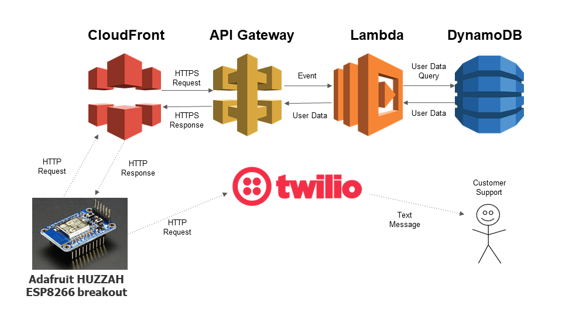

# Medspense Cloud
Medspense is a five-member medical dispenser prototype project that aims to improve the prescription fulfillment process. When a doctor prescribes a Medspense user medication, rather than dropping off the prescription at a pharmacy and waiting for it to be filled, the user can use the nearest Medspense unit (think medical vending machine) which will quickly and easily dispense their prescription. This repo focuses on the cloud portion of the project which was my primary responsibility.

## Design
The main computer hardware is a [DE1-SoC](https://www.terasic.com.tw/cgi-bin/page/archive.pl?Language=English&No=836). To connect to the internet, an [Adafruit HUZZAH ESP8266 Breakout](https://learn.adafruit.com/adafruit-huzzah-esp8266-breakout/overview) WiFi microcontroller is attached to a UART serial port.

- The **Cloud API** is used by the main program running on the DE1-SoC's ARM dual-core Cortex-A9 embedded cores to interface with the WiFi controller.
- The **WiFi Controller Scripts** run on the Adafruit HUZZAH ESP8266 Breakout to fetch data from DynamoDB, send text messages via Twilio, and pulse an LED.

### Cloud Architecture

### Cloud Storage
Amazon DynamoDB is used to store user data. Due to the limitations of the Wifi controller, three other AWS services were used to retrieve the data.

A more direct approach would be to directly interface with the [DynamoDB Low-Level API](https://docs.aws.amazon.com/amazondynamodb/latest/developerguide/Programming.LowLevelAPI.html) from the WiFi controller but this would be a large undertaking given the confinements of [NodeMCU](https://nodemcu.readthedocs.io/en/master/).

#### [Amazon CloudFront](https://aws.amazon.com/cloudfront/)
Because the WiFi controller only supports HTTP and API Gateway only supports HTTPS, Amazon Cloudfront acts as a proxy server, receiving HTTP Requests from the WiFi controller and forwarding the data in a HTTPS request to API Gateway. Likewise, CloudFront receives HTTPS responses from API Gateway and forwards a HTTP response back to the WiFi controller.

#### [Amazon API Gateway](https://aws.amazon.com/api-gateway/)
Per the AWS website, API Gateway acts "as the front door for applications to access data, business logic, or functionality from your backend services". In our case, API Gateway receives a HTTPS request that contains a user ID and then ivokes a Lambda to fetch the user's data. The user data returned by the Lambda is returned to CloudFront in an HTTPS response.

#### [AWS Lambda](https://aws.amazon.com/lambda/)
The Lambda invoked by API Gateway queries the user data from DynamoDB using the given user ID and returns the data.

#### [Amazon DynamoDB](https://aws.amazon.com/dynamodb/)
*Table attributes*:
- **user_id** (primary key): Personal Health Number (PHN).
- **face_id**: Reference photo encoding used for facial recognition verification.
- **medication**: List of prescriptions.
  - Each medication has a name, weight, and quantity
- **name**: The patient's first and last name.

### Sending Text Messages
If a customer is in need of assistance, we send a HTTP request to the [Twilio](https://www.twilio.com/) API with the desired message and Twilio forwards the message via SMS to the support team.

### Resources
- DE1-SoC: https://www.terasic.com.tw/cgi-bin/page/archive.pl?Language=English&No=836
- Adafruit HUZZAH ESP8266 breakout: https://learn.adafruit.com/adafruit-huzzah-esp8266-breakout/overview
- NodeMCU: https://nodemcu.readthedocs.io/en/master/
- Amazon CloudFront: https://aws.amazon.com/cloudfront/
- Amazon API Gateway: https://aws.amazon.com/api-gateway/
- AWS Lambda: https://aws.amazon.com/lambda/
- Amazon DynamoDB: https://aws.amazon.com/dynamodb/
- Twilio: https://www.twilio.com/
- DynamoDB Low-Level API: https://docs.aws.amazon.com/amazondynamodb/latest/developerguide/Programming.LowLevelAPI.html